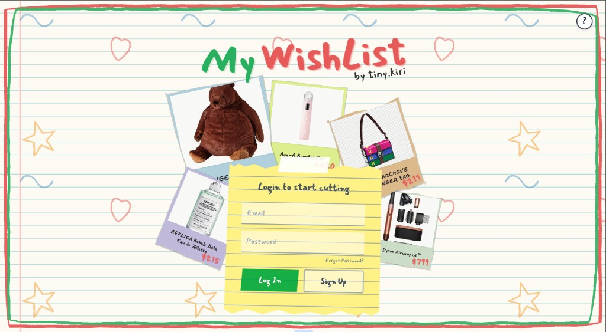
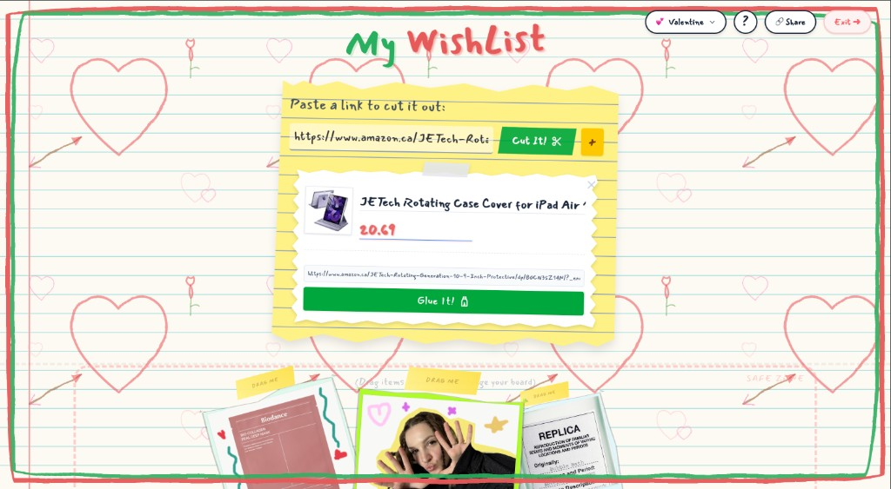
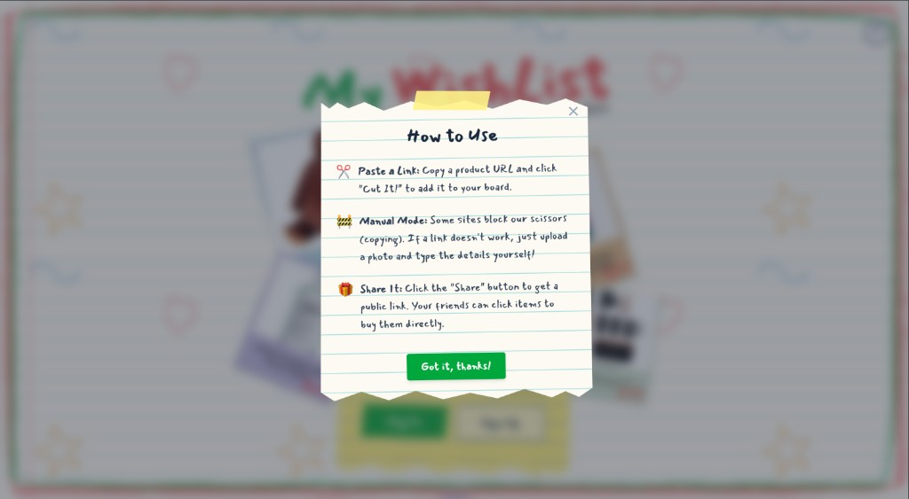
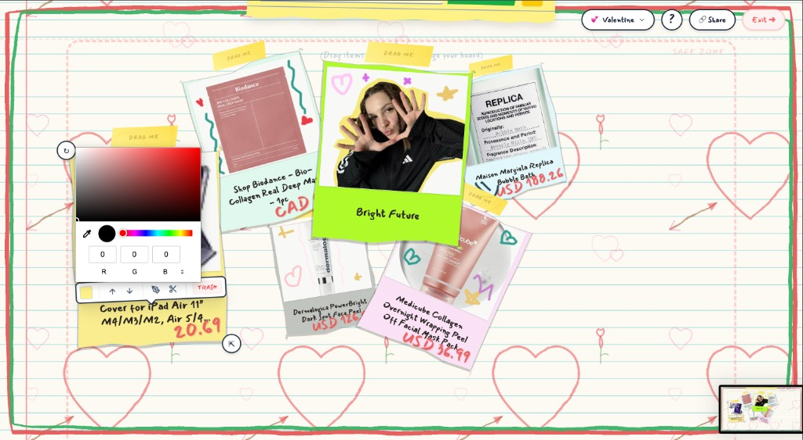
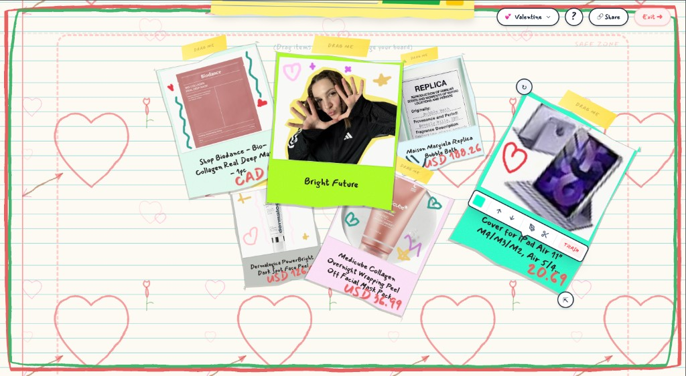
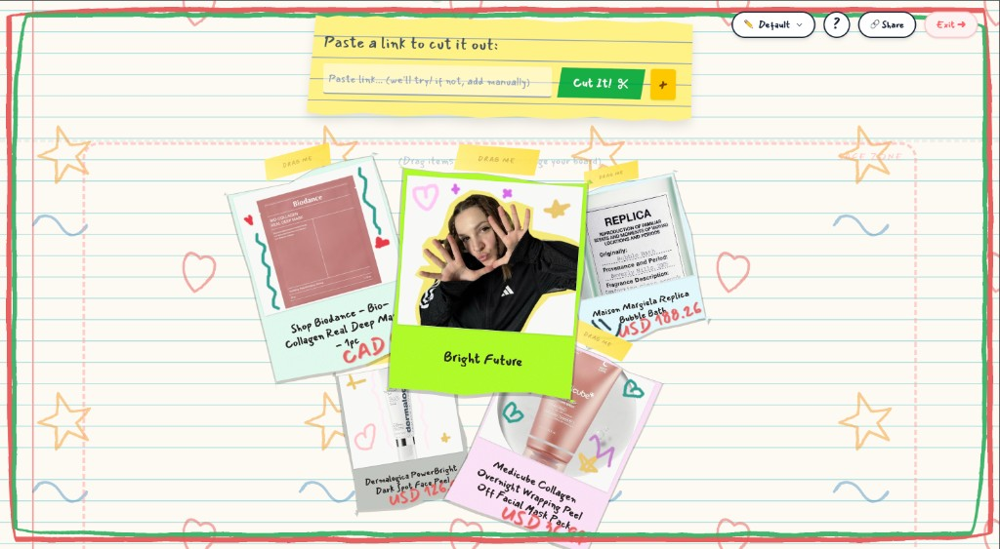
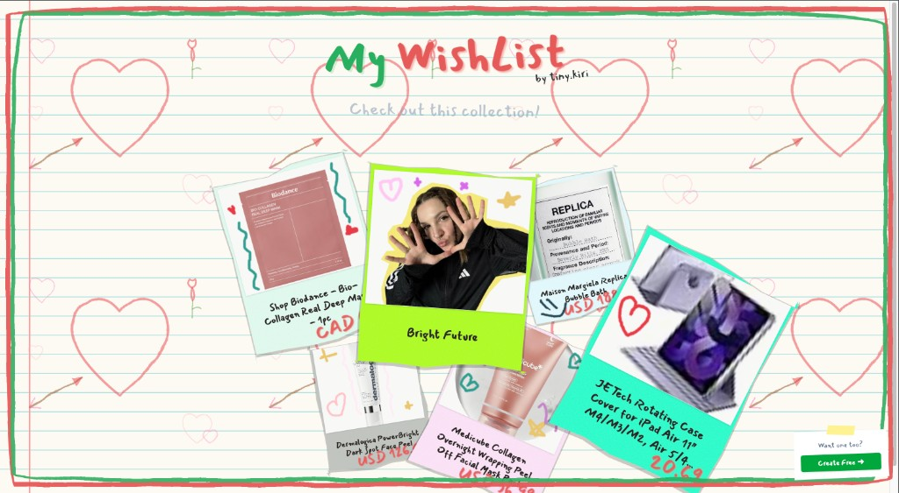
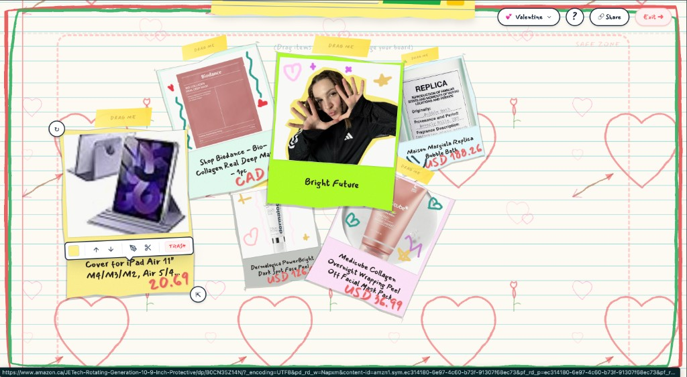
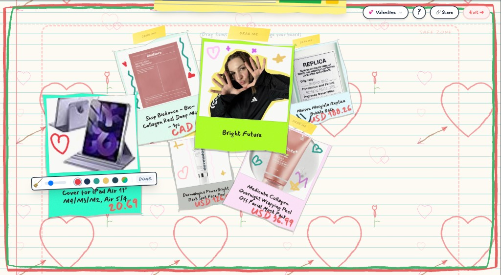
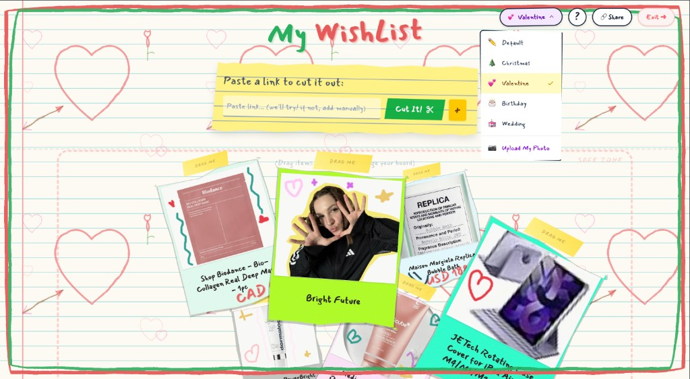

# Wishbook

A scrapbook for your wishes — pin the things you want on a board and share it with friends.

## Features

- **Add items by link or by hand** — paste a URL and the title, image, and price get pulled in automatically, or fill it in yourself
- **Style your cards** — pick the shape and color, doodle on them with crayons
- **Arrange your board** — drag cards wherever you want
- **Change themes** — switch up the board's background, or use your own photo
- **Share with friends** — send them a link; they see your board and can click any card to open the item

## Tech stack

Next.js · React · TypeScript · Tailwind CSS · Supabase

## Getting started

```bash
npm install
npm run dev
```

## Screenshots











