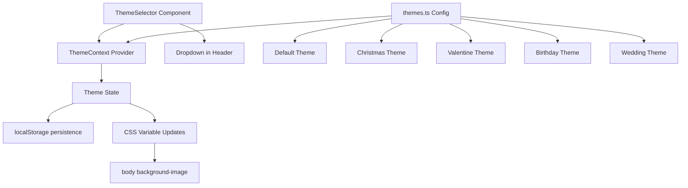

# Theme System Architecture Plan

## Overview

Add a manual theme selector to the WishList app that allows users to change the background doodles for different occasions: **Christmas**, **Valentine's Day**, **Birthday**, and **Wedding**.

## Current State Analysis

The existing background is defined in [`globals.css`](src/app/globals.css:16-41) with:
- **Layer 1**: SVG doodles (hearts, stars, squiggles) with a wavy filter
- **Layer 2**: Notebook lines (red margin + blue horizontal lines)

The doodles are hardcoded as an inline SVG data URL in the `body` background-image property.

## Architecture



## File Structure

```
src/
├── lib/
│   └── themes.ts              # Theme definitions with SVG backgrounds
├── contexts/
│   └── ThemeContext.tsx       # React context for theme state
├── components/
│   └── ThemeSelector.tsx      # Dropdown component for theme selection
├── app/
│   ├── globals.css            # Updated with CSS variable for doodles
│   ├── layout.tsx             # Wrap with ThemeProvider
│   └── page.tsx               # Add ThemeSelector to header
```

## Theme Definitions

Each theme will have a unique SVG doodle pattern:

### 1. Default Theme (Current)
- Hearts, stars, squiggles in red/orange/blue
- Current implementation preserved

### 2. Christmas Theme 🎄
- Snowflakes, Christmas trees, ornaments, candy canes
- Colors: green, red, gold, white

### 3. Valentine Theme 💕
- Hearts (multiple sizes), cupid arrows, roses
- Colors: pink, red, light pink

### 4. Birthday Theme 🎂
- Balloons, confetti, party hats, presents, cake
- Colors: bright multicolor (yellow, blue, pink, green)

### 5. Wedding Theme 💒
- Rings, bells, doves, flowers, hearts
- Colors: gold, white, soft pink, silver

## Implementation Details

### [`themes.ts`](src/lib/themes.ts)

```typescript
export interface Theme {
  id: string;
  name: string;
  emoji: string;
  doodleSvg: string; // Data URL for background SVG
}

export const themes: Theme[] = [
  { id: 'default', name: 'Default', emoji: '✏️', doodleSvg: '...' },
  { id: 'christmas', name: 'Christmas', emoji: '🎄', doodleSvg: '...' },
  { id: 'valentine', name: 'Valentine', emoji: '💕', doodleSvg: '...' },
  { id: 'birthday', name: 'Birthday', emoji: '🎂', doodleSvg: '...' },
  { id: 'wedding', name: 'Wedding', emoji: '💒', doodleSvg: '...' },
];
```

### [`ThemeContext.tsx`](src/contexts/ThemeContext.tsx)

```typescript
'use client'
import { createContext, useContext, useState, useEffect } from 'react';
import { themes, Theme } from '@/src/lib/themes';

interface ThemeContextType {
  currentTheme: Theme;
  setTheme: (themeId: string) => void;
}

// Provider that:
// 1. Loads theme from localStorage on mount
// 2. Updates CSS variable --doodle-background when theme changes
// 3. Persists selection to localStorage
```

### [`ThemeSelector.tsx`](src/components/ThemeSelector.tsx)

A dropdown component styled to match the app's crayon aesthetic:
- Shows current theme emoji + name
- Dropdown with all theme options
- Positioned in the header menu area

### CSS Variable Approach

In [`globals.css`](src/app/globals.css), change the hardcoded doodle SVG to use a CSS variable:

```css
body {
  background-image:
    var(--doodle-background),  /* Theme-specific doodles */
    /* Notebook lines remain unchanged */
    linear-gradient(90deg, transparent 3rem, #ff9999 3rem, ...),
    repeating-linear-gradient(...);
}
```

The ThemeContext will update `--doodle-background` on the document root when theme changes.

## User Flow

1. User clicks theme selector in header
2. Dropdown shows: ✏️ Default, 🎄 Christmas, 💕 Valentine, 🎂 Birthday, 💒 Wedding
3. User selects a theme
4. Background doodles instantly change
5. Selection persists in localStorage
6. On next visit, saved theme is restored

## Share Page Consideration

The share page ([`/share/[shareKey]/page.tsx`](src/app/share/[shareKey]/page.tsx)) should:
- Use the default theme (no selector shown)
- OR inherit the owner's theme preference (future enhancement)

For now, keep share page on default theme.

## Summary of Changes

| File | Action |
|------|--------|
| `src/lib/themes.ts` | **Create** - Theme definitions with SVG backgrounds |
| `src/contexts/ThemeContext.tsx` | **Create** - React context for theme state |
| `src/components/ThemeSelector.tsx` | **Create** - Dropdown UI component |
| `src/app/globals.css` | **Modify** - Use CSS variable for doodles |
| `src/app/layout.tsx` | **Modify** - Wrap with ThemeProvider |
| `src/app/page.tsx` | **Modify** - Add ThemeSelector to header |
